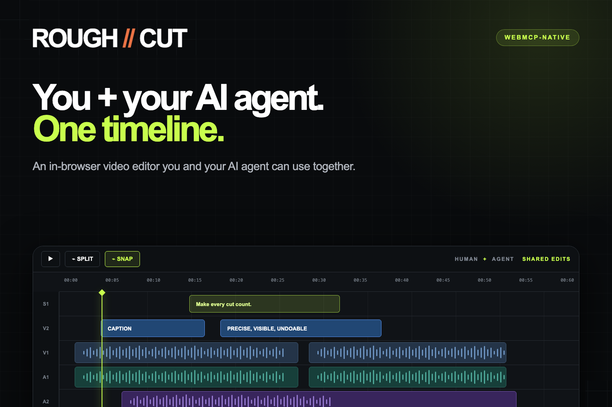

# ROUGH//CUT



**A human-first video editor built for working with AI, not handing the edit over to it.**

[Try ROUGH//CUT](https://rough-cut.samarthsaxena1672003.workers.dev) · [View the source](https://github.com/awesamarth/rough-cut)

## Why I built it

Most AI video editors take too much control away from the person making the video. They generate an edit behind the scenes, then give you a result that is difficult to inspect or change precisely.

I have been editing videos for over five years, and that approach never felt right to me. There are plenty of repetitive editing tasks that should be automated, but the human behind the production should still have complete creative control.

WebMCP made a different model possible: an external AI agent can enter the same editor as the human, use the same tools, and work on the same timeline.

## What it does

ROUGH//CUT is an in-browser video editor that you and any WebMCP-compatible AI agent can use together.

Upload a real interview, podcast, tutorial, or product demo. ROUGH//CUT transcribes it with word-level timestamps and gives you a synchronized video preview, transcript, inspector, and multi-lane timeline. You can edit manually, ask an agent to handle repetitive work, or move between the two at any point.

Both you and the agent operate the same project through the same editing commands. Agent actions appear immediately in the editor, are recorded in the activity feed, and remain undoable.

## What you can do

- Split, trim, delete, ripple-delete, and reorder clips
- Edit directly from the transcript
- Detect and review silence before removing it
- Protect important ranges from destructive edits
- Adjust brightness, contrast, saturation, hue, volume, speed, zoom, and position
- Add cuts, crossfades, fade-to-black transitions, and edge fades
- Generate, style, edit, and resync captions from the saved transcript
- Add text overlays and B-roll markers
- Upload and edit background music with gain, speed, trims, fades, and looping
- Scrub, zoom, pan, snap, and edit with familiar keyboard shortcuts
- Export a real 1080p H.264 MP4, CMX3600-style EDL, or SRT file

The original video and music are never modified. Every edit is non-destructive and stored as part of a versioned project.

## Human and agent, one timeline

ROUGH//CUT does not include a built-in chatbot or a proprietary agent. Instead, it exposes 40 focused tools directly through the native WebMCP API.

```text
Human controls ─┐
                ├─ editing commands → versioned project → preview and export
WebMCP agent ───┘
```

This shared command layer is the core of the project:

- The agent never works inside a hidden copy of the edit.
- Human and agent changes use the same validation, persistence, and undo history.
- Every mutation requires the current project version.
- If you edit while an agent is working, stale agent actions are rejected instead of overwriting your work.
- Uploads and downloads remain visible human handoffs because the browser requires user approval for local files.

A prompt like this can produce a complete, inspectable first pass:

> Make this energetic, preserve the technical explanation, add subtle fades and captions, and mark B-roll opportunities.

You can then review every change, adjust clips manually, undo anything you dislike, and ask the agent to continue from the new version.

## Real media, not a mocked demo

ROUGH//CUT handles real uploads, transcription, persistence, waveforms, silence detection, timeline playback, and exports.

Transcription uses Whisper Large V3 Turbo through Cloudflare Workers AI, with optional support for OpenAI `whisper-1`. Transcript words keep stable IDs and source timestamps, allowing generated captions to follow cuts, trims, reordering, ripple edits, and speed changes without running transcription again.

FFmpeg handles waveform generation, silence detection, audio processing, and final rendering inside an on-demand Cloudflare Container. The browser preview and FFmpeg renderer share the same timeline calculations and canonical 1920×1080 coordinate system so the exported video matches the edit shown in the browser.

## Built with

- Next.js, React, TypeScript, and Tailwind CSS
- Native `document.modelContext.registerTool` WebMCP integration
- Cloudflare Workers, D1, R2, Workers AI, and Containers
- FFmpeg for media analysis and final rendering
- OpenAI Whisper as an optional bring-your-own-key transcription provider

OpenAI keys are session-only by default. They are remembered in device-local storage only when the user explicitly asks for it, and are never stored by the server.

## Try it

1. Open the [live app](https://rough-cut.samarthsaxena1672003.workers.dev) in a WebMCP-compatible browser.
2. Upload a browser-playable video. H.264/AAC MP4 works best.
3. Edit manually, or connect an external WebMCP agent and ask it to inspect the project.
4. Review the visible changes in the timeline and activity feed.
5. Export the finished video, EDL, or captions.

For WebMCP testing in Chrome, enable `chrome://flags/#enable-webmcp-testing` if your browser requires it.

## Build and run locally

### Requirements

- [Bun](https://bun.sh/)
- [Docker Desktop](https://www.docker.com/products/docker-desktop/)
- [Wrangler](https://developers.cloudflare.com/workers/wrangler/) authentication

### Setup

```bash
git clone https://github.com/awesamarth/rough-cut.git
cd rough-cut
bun install
cp .env.example .dev.vars
bunx wrangler login
bun run db:migrate:local
docker compose up --build -d
bun run dev
```

Open [http://localhost:3000](http://localhost:3000). The local FFmpeg media service runs at [http://localhost:8788](http://localhost:8788).

The default local configuration uses `local-dev` as the shared media-service token and accesses Workers AI remotely through your authenticated Cloudflare account.

### Useful commands

```bash
bun test                 # Run the test suite
bun run typecheck        # Check TypeScript
bun run lint             # Run ESLint
bun run build            # Create a production Next.js build
curl localhost:8788/health
docker compose logs -f media
```

Stop the local media service with:

```bash
docker compose down
```

## License

ROUGH//CUT is open source under the [MIT License](LICENSE).
