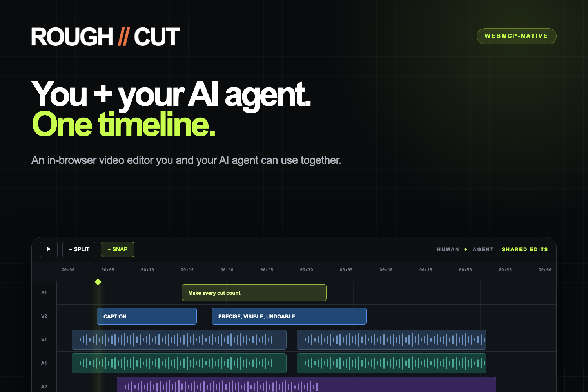

# ROUGH//CUT



**A human-first video editor built for working with AI, not handing the edit over to it.**

[Try ROUGH//CUT](https://rough-cut.awesamarth.dev) · [View the source](https://github.com/awesamarth/rough-cut)

## Why I built it

Most AI video editors take too much control away from the person making the video. They generate an edit behind the scenes, then give you a result that is difficult to inspect or change precisely.

I have been editing videos for over five years, and that approach never felt right to me. There are plenty of repetitive editing tasks that should be automated, but the human behind the production should still have complete creative control.

WebMCP made a different model possible: an external AI agent can enter the same editor as the human, use the same tools, and work on the same timeline.

> **Local-first version deployed separately:** https://rough-cut.awesamarth.dev (also available at https://rough-cut-improvements.samarthsaxena1672003.workers.dev). The original hackathon Worker is protected and remains on its original version. Production D1 migrations are applied; Cloudflare transcription is limited to 600 minutes/120 requests daily, and Container rendering remains disabled. HTTP smoke checks passed; see [AGENTS.md](AGENTS.md) for media-test evidence and remaining manual checks.

## What it does

ROUGH//CUT is an in-browser video editor that you and any WebMCP-compatible AI agent can use together.

Select a local interview, podcast, tutorial, or product demo—no account or source upload required. ROUGH//CUT provides a synchronized preview, inspector and multi-lane timeline. Optional, explicitly approved cloud transcription adds a word-timestamped transcript. You can edit manually, ask an agent to handle repetitive work, or move between the two at any point.

Both you and the agent operate the same project through the same editing commands. Agent actions appear immediately in the editor, are recorded in the activity feed, and remain undoable.

## What you can do

- Split, trim, delete, ripple-delete, and reorder clips
- Edit directly from the transcript
- Detect and review silence before removing it
- Protect important ranges from destructive edits
- Adjust brightness, contrast, saturation, hue, volume, speed, zoom, and position
- Add cuts, crossfades, fade-to-black transitions, and edge fades
- Generate, style, edit, and resync captions from the saved transcript
- Add text overlays and B-roll markers
- Select and edit local background music with gain, speed, trims, fades, and looping
- Scrub, zoom, pan, snap, and edit with familiar keyboard shortcuts
- Export a real 1080p H.264 MP4, CMX3600-style EDL, or SRT file

The original video and music are never modified. Every edit is non-destructive and stored as part of a versioned project.

## Human and agent, one timeline

ROUGH//CUT does not include a built-in chatbot or a proprietary agent. Instead, it exposes up to 40 state-appropriate tools directly through the native WebMCP API.

```text
Human controls ─┐
                ├─ editing commands → versioned project → preview and export
WebMCP agent ───┘
```

This shared command layer is the core of the project:

- The agent never works inside a hidden copy of the edit.
- Human and agent changes use the same validation, persistence, and undo history.
- Every mutation requires the current project version.
- If you edit while an agent is working, stale agent actions are rejected instead of overwriting your work.
- Uploads and downloads remain visible human handoffs because the browser requires user approval for local files.

A prompt like this can produce a complete, inspectable first pass:

> Make this energetic, preserve the technical explanation, add subtle fades and captions, and mark B-roll opportunities.

You can then review every change, adjust clips manually, undo anything you dislike, and ask the agent to continue from the new version.

## Real media, not a mocked demo

ROUGH//CUT handles real media, optional transcription, persistence, waveforms, silence detection, timeline playback, and exports.

Transcription uses Whisper Large V3 Turbo through Cloudflare Workers AI, with optional support for OpenAI `whisper-1`. It processes only source ranges retained in the current edit, once each, in chunks of at most five source minutes. Completed parts are merged and saved as they finish; cancellation keeps them visible and offers continuation. Existing unprocessed words are preserved, and a concurrent project edit stops stale transcription updates. Transcript words keep stable IDs and source timestamps, allowing generated captions to follow cuts, trims, reordering, ripple edits, and speed changes without running transcription again.

Mediabunny now prepares transcription audio and computes waveforms/silence candidates locally in a browser worker. Immutable-asset analysis and successful transcription chunks are cached locally when storage is available. Actual source track configurations are checked before acceptance and relinking: native WebCodecs are preferred, with lazy local ProRes, AC-3/E-AC-3, and DTS decoders where needed. A source with no audio track remains valid; an unsupported audio track is reported instead of being silently discarded. The upload screen offers an off-by-default **Automatically transcribe new videos using Workers AI** checkbox, with explicit cloud-audio disclosure. Its choice is remembered in localStorage. Opted-in new uploads start transcription once without a second confirmation; reopening projects or importing backups does not start or retry it. Manual transcription still asks for confirmation. All cloud budget limits continue to apply; opening the editor never starts Container analysis.

The working-tree editor now shares browser video/audio composition across preview, exact-frame inspection and worker MP4 export. SoundTouch preserves pitch during speed changes; an actual AAC timing probe compensates encoder priming without discarding the beginning of the audio. Export checks canonical H.264 and AAC encoding independently before rendering or cloud-output admission, lazily loading the local AAC encoder only when native AAC encoding is unavailable. H.264/HEVC configurations unsupported by the browser remain unsupported; cloud codec fallback is backlog-only. The single **Export MP4** flow streams to a writable file picker where supported. Otherwise it uses OPFS followed by Download when the safety-adjusted output estimate fits; known insufficient space, or a confirmed OPFS quota failure after cleanup, offers temporary cloud storage in a separate human-consent dialog. Canceling the file picker, canceling export, codec failures and other render failures never fall through to cloud upload. **Saved exports** recovers browser copies after navigation and lets you delete them explicitly; copies are not silently expired during downloads.

`bun run test:codecs` exercises the real extension WASM in Node with tiny synthetic fixtures (requires FFmpeg/FFprobe): ProRes frame decode, AC-3/E-AC-3/DTS audio decode and AAC MP4 encoding with independent decoding. Browser extension loading, canvas parity and extension-backed A/V synchronization still need manual verification. Before public distribution, establish exact corresponding source/build provenance and redistribution materials for bundled FFmpeg WASM; package wrapper licenses alone do not establish this compliance.

Edits and undo/redo history persist in IndexedDB (up to 100 steps and a 16 MiB serialized-history budget). Source media is not copied into browser storage; reopening requires relinking the original files. Download project backups before clearing browser storage. Pending-save backups can be imported as separate projects after a conflict.

Isolated Chrome/Brave application tests cover playback, composed inspection, downloaded MP4 duration, durable undo/relinking, stale-save recovery, pending-backup import and export recovery/deletion with zero cloud API requests. Media tests cover crossfade pixel parity, fade-black, pitch-preserving speed, AAC synchronization, silent variable-frame-rate video, trimmed/looped music and fades, cancellation, quota preflight, injected write failures, and failed worker-start cleanup. A local Chrome ten-minute synthetic export downloaded with an exact 600-second duration in about 79 seconds; summed browser-process RSS peaked at 1634 MiB and returned near its 1508 MiB baseline (shared pages are counted more than once). **This is not hour-long/4K/mobile memory proof or a physically full-disk test; full fixture parity and actual ChatGPT in-app download UX remain unverified.** Explicit R2 output storage is implemented and tested against local Cloudflare D1/R2; a hardened codec-rendering fallback remains unimplemented. Storage/codec failures never silently start cloud rendering.

## Optional temporary cloud output

When local output space is known to be insufficient, **Export MP4** can offer temporary cloud storage. It still renders in the browser and proceeds only after a styled human confirmation. It sends only encoded MP4 bytes—not source media or project JSON—to R2. Unknown quota estimates try the local path and do not grant upload permission. The cloud writer uses bounded 5 MiB chunks, retaining the MP4 header and trailing metadata for final correction rather than buffering the full movie. Download streams the chunks with byte-range support; it does not download the whole movie into JavaScript memory.

Access is scoped by HttpOnly, SameSite cookies (Secure on HTTPS), not credentials in URLs. Access lasts 24 hours with at most 10 download requests. The editor remembers its latest cloud output per project; downloads require the same browser's cookie. Delete explicitly, or let the bucket lifecycle expire stored chunks. Bucket expiry is not instantaneous.

Owner-authorized storage export is enabled in production and local development against the dedicated remote **`rough-cut-outputs`** Standard R2 bucket (`OUTPUTS` binding). The existing `MEDIA` bucket is unchanged. Configuration reserves up to **8192 MiB/day per D1 environment**; Containers remain off (`CLOUD_EXPORTS_DAILY_LIMIT=0`). Local development and production use separate D1 admission counters, not an account-wide budget. Production migrations `0002` and `0003` are applied.

For any separately authorized deployment/new environment:
- Apply migrations `0002_cloud_usage.sql` and `0003_cloud_outputs.sql` to its D1 binding before serving traffic.
- Verify the **two-day object-expiry rule**, scoped strictly to `rough-cut-output/` in the OUTPUTS bucket. It covers incomplete and completed outputs without touching other prefixes. This rule is configured and read-back verified for `rough-cut-outputs`.
- Set runtime `CLOUD_OUTPUT_LIFECYCLE_READY=1` only after that rule exists, and choose `CLOUD_OUTPUT_DAILY_MIB`. Hard ceilings: 8192 MiB/day, 4096 MiB/output, 20 admissions/day, two concurrent uploads, one in-flight part/output, one hour/upload. Failed or busy admissions retain their reservation; there are no automatic upload/render retries.
- Keep Container-rendering allowances separate and disabled until codec fallback is finished. Cloud credits are not an account-wide spending cap.

[R2 Standard pricing](https://developers.cloudflare.com/r2/pricing/): $0.015/GB-month, $4.50/million Class A writes and $0.36/million Class B reads, free direct egress, before shared account free allowances. Objects explicitly use Standard storage. Request admission and lifecycle bound this output path, not unrelated Workers/D1/R2 usage. Automatic invocation logs are disabled; do not add logging of Cookie/Set-Cookie headers.

`bun run test:cloud` uses **local** Miniflare D1/R2. It runs in Node because Bun currently cannot clone the Web Streams used by Miniflare's R2 proxy. `CLOUD_BROWSER_TEST=1 bun run test:cloud` additionally runs the existing muted browser probe through the real export worker and local R2 service. Neither command uses a cloud account or paid processing.

## Built with

- Next.js, React, TypeScript, and Tailwind CSS
- Native `document.modelContext.registerTool` WebMCP integration
- Cloudflare Workers, D1, R2, Workers AI, and Containers
- Mediabunny for browser decoding, analysis, encoding and streaming MP4 muxing (optional local codec extensions are listed in [media dependency notices](public/media-notices.txt))
- SoundTouch Core for pitch-preserving audio tempo adjustment
- FFmpeg retained for the legacy cloud pipeline and local verification; not the normal editor export path
- OpenAI Whisper as an optional bring-your-own-key transcription provider

OpenAI keys are session-only by default. They are remembered in device-local storage only when the user explicitly asks for it, and are never stored by the server.

## Try it

1. Open the [live app](https://rough-cut.awesamarth.dev) in a WebMCP-compatible browser.
2. Upload a browser-playable video. H.264/AAC MP4 works best.
3. Edit manually, or connect an external WebMCP agent and ask it to inspect the project.
4. Review the visible changes in the timeline and activity feed.
5. Export the finished video, EDL, or captions.

For WebMCP testing in Chrome, enable `chrome://flags/#enable-webmcp-testing` if your browser requires it.

## Build and run locally

### Requirements

- [Bun](https://bun.sh/)
- Chrome/Brave with WebCodecs, OPFS and Web Locks
- FFmpeg/FFprobe for the optional local browser test scripts
- Docker and Wrangler authentication only for optional legacy/cloud development

### Setup

```bash
git clone https://github.com/awesamarth/rough-cut.git
cd rough-cut
bun install
bun run dev
```

Open [http://localhost:3000](http://localhost:3000). Normal local editing and builds do not initialize a Cloudflare development proxy.

For optional cloud development: copy `.env.example` to `.dev.vars`, authenticate Wrangler, apply local migrations, and use `ENABLE_CLOUD_DEV=1 bun run dev`. The legacy FFmpeg service can be started separately with `docker compose up --build -d` at port 8788. **Owner-funded cloud processing fails closed unless you configure admission limits** after applying all migrations:

```dotenv
# Defaults are 0 (disabled); choose limits only after reviewing your budget.
CLOUD_TRANSCRIPTION_DAILY_MINUTES=0
CLOUD_EXPORTS_DAILY_LIMIT=0
```

These are app-wide daily admission limits, not a Cloudflare account spending cap. Transcription accepts only validated mono 16 kHz PCM WAV chunks up to five minutes and reserves their actual duration before inference (maximum 120 requests/day). Failed requests retain reservations. Cloud export currently accepts timelines up to ten minutes. Unknown/expired export IDs cannot wake the Container through the public proxy. New cloud source-upload allocation is retired. Remaining legacy project/media/music/upload-completion routes have not received a complete security audit. Container fallback remains disabled and requires separate security/lifecycle work before any future activation.

Local and legacy-cloud saves use a fail-stop queue and per-tab recovery journal. A conflict stops subsequent writes, preserves pending work and offers an importable backup. Web Locks prevent duplicated tabs from claiming the same live journal. Browser storage can still be evicted or cleared; backups and original media remain the user's responsibility.

### Useful commands

```bash
bun test                 # Run the test suite
bun run typecheck        # Check TypeScript
bun run lint             # Run ESLint
bun run build            # Create a production Next.js build
bun run scripts/check-browser-media.ts # Isolated headless Chrome media/storage checks
bun run scripts/check-editor.ts       # Actual built app: playback, export/download, save/recovery (build first)
MEDIA_TEST_SECONDS=600 bun run scripts/check-editor.ts # Optional 10-minute synthetic export; reports browser RSS
# Browser checks are muted and remove their temporary servers, profiles and output files.
# To test Brave instead:
BROWSER_BIN='/Applications/Brave Browser.app/Contents/MacOS/Brave Browser' bun run scripts/check-browser-media.ts
curl localhost:8788/health
docker compose logs -f media
```

Stop the local media service with:

```bash
docker compose down
```

## License

ROUGH//CUT's own code is open source under the [MIT License](LICENSE). Bundled media libraries and fonts retain their respective licenses; see [media dependency notices](public/media-notices.txt) for licenses and corresponding source.
